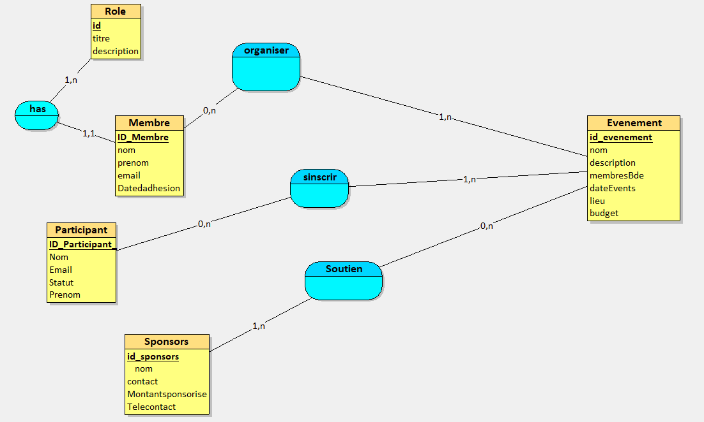
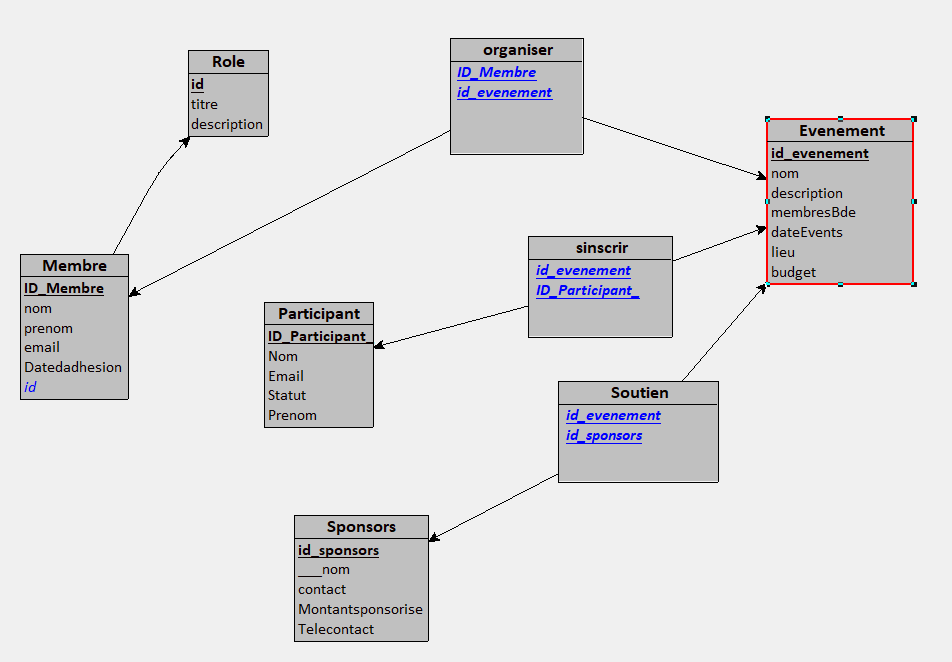

# Gestion-des-Activites-dun-BDE
<h1 align="center">
  
</h1>

<h1>modèle logique de donnée (MLD)</h1>

<h1 align="center">
  
</h1>

Evenement = (id_evenement INT, nom VARCHAR(50), description VARCHAR(50), membresBde VARCHAR(50), dateEvents DATE, lieu VARCHAR(50), budget DOUBLE); 
Sponsors = (id_sponsors INT, ___nom VARCHAR(50), contact INT, Montantsponsorise DOUBLE, Telecontact INT); 
Participant = (ID_Participant_ VARCHAR(50), Nom VARCHAR(50), Email VARCHAR(50), Statut VARCHAR(50), Prenom VARCHAR(50)); 
Role = (id INT, titre VARCHAR(50), description VARCHAR(50)); 
Membre = (ID_Membre INT, nom VARCHAR(50), prenom VARCHAR(50), email VARCHAR(50), Datedadhesion DATETIME, #id); 
organiser = (#ID_Membre, #id_evenement); 
sinscrir = (#id_evenement, #ID_Participant_); 
Soutien = (#id_evenement, #id_sponsors); 

